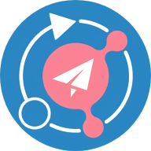

<div align="center">
  
</div>

<h1 align="center">SSPanel UIM</h1>

<p align="center">
  <em>Across the Great Wall we can reach every corner in the world</em>
</p>

<p align="center">
  <a href="https://trendshift.io/repositories/1832" target="_blank">
    
  </a>
</p>

<p align="center">
  <a href="https://github.com/Anankke/SSPanel-UIM/stargazers">
    
  </a>
  <a href="https://github.com/Anankke/SSPanel-UIM/network/members">
    
  </a>
</p>

<p align="center">
  <a href="https://github.com/Anankke/SSPanel-UIM/blob/dev/LICENSE">
    
  </a>
  <a href="https://github.com/Anankke/SSPanel-UIM/issues">
    
  </a>
  <a href="https://github.com/Anankke/SSPanel-UIM/graphs/contributors">
    
  </a>
  <a href="https://www.php.net">
    
  </a>
</p>

<p align="center">
  <a href="https://github.com/Anankke/SSPanel-UIM/actions/workflows/lint.yml">
    
  </a>
  <a href="#code-quality">
    
  </a>
  <a href="#code-quality">
    
  </a>
  <a href="#code-quality">
    
  </a>
  <a href="#code-quality">
    
  </a>
</p>

<p align="center">
  <a href="https://docs.sspanel.io">
    
  </a>
  <a href="https://t.me/sspanel_Uim">
    
  </a>
  <a href="https://t.me/SSUnion">
    
  </a>
  <a href="https://github.com/Anankke/SSPanel-UIM/discussions">
    
  </a>
</p>

<p align="center">
  
  
  
  
  
  
</p>

## 简介 | Introduction

SSPanel-UIM 节点采集版是基于 SSPanel-UIM 的增强版本，新增了**节点自动采集功能**，可以从外部 URL 自动采集节点并保存到数据库，大大减少手动配置节点的工作量。

SSPanel-UIM Node Collector Edition is an enhanced version of SSPanel-UIM with **automatic node collection feature**, which can automatically collect nodes from external URLs and save them to the database, greatly reducing the workload of manual node configuration.

**主要特性：**
- ✅ 支持从多个 URL 源自动采集节点
- ✅ 支持多种协议：vmess, ss, trojan, vless, ssr, hysteria2, tuic
- ✅ 管理界面配置采集源和参数
- ✅ 定时自动采集功能
- ✅ 采集日志和状态监控
- ✅ 保留所有原 SSPanel-UIM 功能

**Main Features:**
- ✅ Automatic node collection from multiple URL sources
- ✅ Support multiple protocols: vmess, ss, trojan, vless, ssr, hysteria2, tuic
- ✅ Admin interface for collector configuration
- ✅ Scheduled automatic collection
- ✅ Collection logs and status monitoring
- ✅ All original SSPanel-UIM features preserved

## 特性 | Features

### 多协议支持 | Multi-Protocol Support

- 支持 Shadowsocks 2022、V2Ray、Trojan、TUIC 等主流协议
- Support for Shadowsocks 2022, V2Ray, Trojan, TUIC and other mainstream protocols
- 通用订阅接口，一键分发 json/clash/sip008/sing-box 格式订阅
- Universal subscription interface, one-click json/clash/sip008/sing-box format subscription distribution

### 支付系统 | Payment System  

- 集成支付宝当面付、PayPal、Stripe、Cryptomus 等多种支付网关
- Integrate Alipay F2F, PayPal, Stripe, Cryptomus and other payment gateways
- 灵活的计费模式：包年包月、按量付费、按接入类型计费
- Flexible billing modes: annual/monthly, pay-as-you-go, access type billing

### 通知系统 | Notification System

- 支持多种邮件服务，内置邮件队列，无需第三方组件
- Support multiple mail services with built-in mail queue, no third-party components required
- Telegram、Discord、Slack 机器人集成
- Telegram, Discord, Slack bot integration

### 用户界面 | User Interface

- 基于 Bootstrap 5 的现代化 Tabler 主题
- Modern Tabler theme based on Bootstrap 5
- 响应式设计，完美支持移动设备
- Responsive design with perfect mobile device support

### 智能功能 | Smart Features

- 深度集成大语言模型，支持工单智能回复、文档生成
- Deep LLM integration for intelligent ticket replies and document generation
- 一键接入 OpenAI、Google AI、Anthropic 等 AI 服务
- One-click access to OpenAI, Google AI, Anthropic and other AI services

### 运维管理 | Operations Management

- 重构的定时任务系统，一条命令完成所有定时任务
- Refactored cron system, complete all scheduled tasks with one command
- 完善的用户管理、节点管理、流量统计系统
- Comprehensive user management, node management, traffic statistics system
- **节点自动采集功能** - 支持从外部 URL 自动采集节点，支持多种协议（vmess, ss, trojan, vless, ssr, hysteria2, tuic）
- **Node Auto-Collection** - Automatically collect nodes from external URLs, supporting multiple protocols

## 系统要求 | System Requirements

### 最低配置 | Minimum Requirements

- **CPU**: 1 核心 | 1 Core
- **内存 | RAM**: 1GB
- **存储 | Storage**: 10GB
- **系统 | OS**: Debian 11+

### 推荐配置 | Recommended Requirements  

- **CPU**: 2 核心或以上 | 2 Cores or more
- **内存 | RAM**: 2GB 或以上 | 2GB or more
- **存储 | Storage**: 20GB SSD
- **系统 | OS**: Debian 12

### 软件环境 | Software Requirements

- **Web 服务器 | Web Server**: Nginx (HTTPS 必须 | HTTPS Required)
- **PHP**: 8.2+ (强烈推荐 OPcache + JIT | OPcache + JIT highly recommended)
- **数据库 | Database**: MariaDB 10.11+ / MySQL 8.0+ (需禁用严格模式 | Disable strict mode required)
- **缓存 | Cache**: Redis 7.0+
- **其他 | Others**: Git, Composer

## 快速开始 | Quick Start

### 一键安装

```bash
# 下载安装脚本
wget https://raw.githubusercontent.com/moneyfly1/myweb/main/install.sh
chmod +x install.sh
sudo ./install.sh
```

### 手动安装

详细安装步骤请参考：
- [DEPLOY.md](DEPLOY.md) - 完整的 VPS 部署指南
- [节点采集功能部署说明.md](节点采集功能部署说明.md) - 节点采集功能配置

## 文档 | Documentation

### 安装文档
- 📚 [DEPLOY.md](DEPLOY.md) - VPS 部署完整指南
- 📚 [install.sh](install.sh) - 一键安装脚本

### 功能文档
- 📚 [节点采集功能部署说明.md](节点采集功能部署说明.md) - 节点采集功能详细说明
- 📚 [GITHUB_SYNC_GUIDE.md](GITHUB_SYNC_GUIDE.md) - GitHub 同步指南

### 原项目文档
完整的 SSPanel-UIM 文档请访问：
For complete SSPanel-UIM documentation, please visit:

📚 [SSPanel-UIM 文档 | Documentation](https://docs.sspanel.io)

## 社区 | Community

- Telegram 频道 | Telegram Channel: [@sspanel_Uim](https://t.me/sspanel_Uim)
- Telegram 群组 | Telegram Group: [@SSUnion](https://t.me/SSUnion)
- GitHub 讨论 | GitHub Discussions: [SSPanel-UIM/Discussions](https://github.com/Anankke/SSPanel-UIM/discussions)

## 贡献 | Contributing

欢迎提交 Pull Request 或 Issue！请先阅读 [贡献指南](CONTRIBUTING.md)。

Welcome to submit Pull Requests or Issues! Please read [Contributing Guide](CONTRIBUTING.md) first.

### 开发规范 | Development Standards
- 代码风格 | Code Style: PSR-12
- 提交规范 | Commit Convention: 参考贡献指南 | See Contributing Guide
- 分支策略 | Branch Strategy: 向 dev 分支提交 | Submit to dev branch

## 安全 | Security

如果您发现安全漏洞，请发送邮件至 anankke@pm.me，不要公开提交 Issue。

If you discover a security vulnerability, please email anankke@pm.me instead of creating a public issue.

## 许可证 | License

本项目采用 MIT 许可证。详见 [LICENSE](LICENSE) 文件。

This project is licensed under the MIT License. See [LICENSE](LICENSE) file for details.

## Star History

[](https://star-history.com/#Anankke/SSPanel-UIM&Date)

---

<p align="center">Made with ❤️ by SSPanel-UIM Team</p>